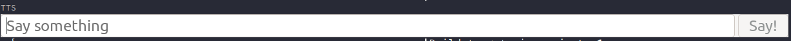

# TTS app

Simple gtk4 frontend for a [TTS server](https://github.com/coqui-ai/TTS).



## Build && install

You will need gtk4 and gstreamer installed.

```console
mkdir build
cd build
meson ..
ninja
```

or with nix

``` console
nix-build
```


First start the tts server. i.e.,

```
$ tts-server --model_name tts_models/en/ljspeech/tacotron2-DDC --vocoder_name vocoder_models/en/ljspeech/hifigan_v2
```

Than the app

```console
$ ./tts-app
```

To connect to a server on a different port/ip

```console
$ TTS_HOST=some.host TTS_PORT=80 ./tts-app
```

## Install in NixOS

```nix
environment.systemPackages = [
  (pkgs.callPackage (pkgs.fetchFromGitHub {
    owner = "Mic92";
    repo = "tts-app";
    rev = "0.0.1";
    sha256 = "sha256-J65Eoa6ua7jdmC8/veVfL5oP1IX5lC94EDxP9L59ufQ=";
    }) {
    ## optional to set a different server
    #defaultHost = "tts.r";
    #defaultPort = "80";
  })
];
```

